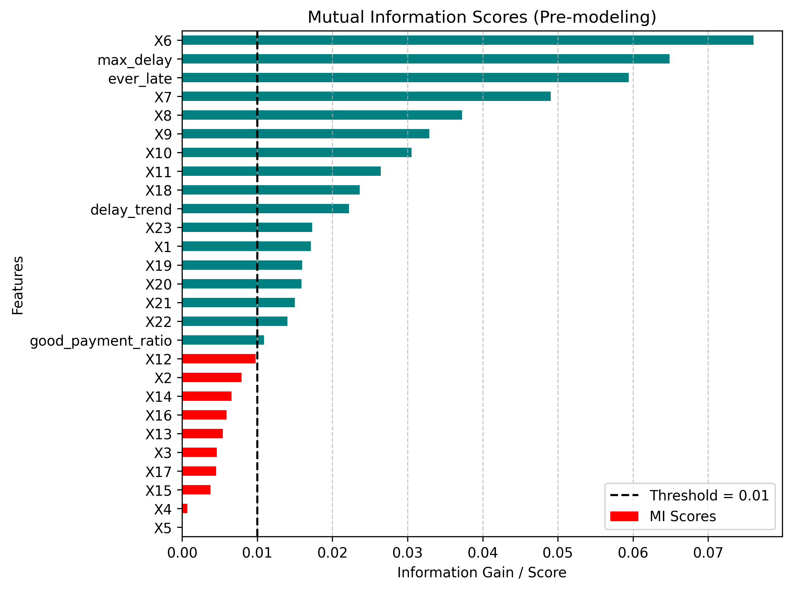
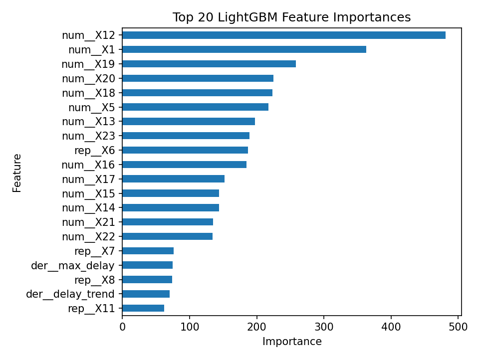

# Credit Default Classifier — AWS Lambda Inference Service

A serverless ML inference service that predicts credit card payment default probability using a LightGBM model deployed as an AWS Lambda container image. Built on the [UCI Default of Credit Card Clients dataset (ID 350)](https://archive.ics.uci.edu/dataset/350/default+of+credit+card+clients).

---

## Overview

This project trains a tuned LightGBM classifier with a full scikit-learn preprocessing pipeline incorporating repayment-based feature engineering, and serves real-time predictions via an AWS Lambda function exposed through API Gateway. The optimal classification threshold is derived from the Precision-Recall curve to maximize F1 score.

**Key design decisions:**
- Models are loaded once at the global scope to take advantage of Lambda warm starts, minimizing cold-start latency on subsequent invocations.
- The preprocessing pipeline (scaling + encoding) is serialized together with the model, guaranteeing identical transformations between training and inference.
- Threshold optimization via Precision-Recall curve avoids the default 0.5 cutoff, which is suboptimal on the class-imbalanced credit default dataset.

---

## Business Problem

Credit card issuers face a fundamental risk management challenge: identifying customers who are likely to default on their next payment before financial losses occur. Extending credit to high-risk customers can lead to charge-offs, collection costs, and increased portfolio risk, while overly restrictive credit decisions can reduce revenue and negatively impact customer experience.

This project predicts the probability that a credit card holder will default on their next monthly payment using historical repayment behavior, billing amounts, payment history, and customer attributes from the UCI Default of Credit Card Clients dataset.

### Who Uses This?

- Credit risk analysts
- Consumer lending teams
- Credit card portfolio managers
- Automated credit decision systems

### What Decision Does It Support?

The estimated probability of default can support decisions such as:

- Approving or rejecting new credit applications
- Increasing or decreasing existing credit limits
- Prioritizing accounts for risk monitoring
- Identifying customers who may require proactive intervention
- Supporting collections and portfolio management strategies

Rather than producing only a binary classification, the model estimates a probability of default, allowing business stakeholders to define decision thresholds according to their risk tolerance and operational objectives.

### Cost of Prediction Errors

#### False Negative (Actual Defaulter Predicted as Low Risk)

A customer who is likely to default is incorrectly classified as low risk. This may result in:

- Financial losses from unpaid balances
- Increased collection and recovery costs
- Greater exposure to portfolio credit risk

#### False Positive (Reliable Customer Predicted as High Risk)

A customer who would have repaid successfully is incorrectly classified as high risk. This may result in:

- Lost lending opportunities
- Reduced customer satisfaction
- Potential customer churn

Because the cost of missing a future defaulter is generally higher than incorrectly flagging a reliable customer, the project prioritizes identifying potential defaulters while maintaining a balance between precision and recall.

### Production Model Performance

The deployed LightGBM model was evaluated on a holdout test set containing 6,000 customers using an optimized classification threshold derived from the Precision-Recall curve.

| Metric | Value |
|----------|----------|
| Accuracy | 0.795 |
| Precision | 0.535 |
| Recall | 0.564 |
| F1 Score | 0.549 |
| ROC AUC | 0.809 |
| Specificity (TNR) | 0.861 |
| False Positive Rate | 0.139 |
| False Negative Rate | 0.436 |

### Confusion Matrix

|                | Predicted No Default | Predicted Default |
|----------------|---------------------|-------------------|
| Actual No Default | 4023 | 650 |
| Actual Default | 579 | 748 |

### Interpretation

The model correctly classified **4,771 out of 6,000 customers**, resulting in an overall **accuracy of 79.5%**. It correctly identified **748 of 1,327 future defaulters (56.4%)** while correctly recognizing **4,023 of 4,673 non-defaulters (86.1%)**.

The **579 false negatives** represent customers who eventually defaulted but were predicted as low risk. These errors are typically the most expensive because the institution may continue extending credit to customers who are likely to miss future payments, leading to financial losses and increased collection costs. The model's **false negative rate of 43.6%** indicates that approximately four out of every ten defaulters are missed.

The **650 false positives** represent customers who would have repaid successfully but were flagged as high risk. These customers may face reduced credit opportunities despite being reliable borrowers. The model's **false positive rate of 13.9%** indicates that only a relatively small portion of non-defaulters are incorrectly flagged.

The **precision of 53.5%** means that when the model predicts a customer will default, it is correct slightly more than half of the time. The **recall of 56.4%** means the model successfully identifies more than half of all future defaulters. Together, these metrics produce an **F1 score of 0.549**, reflecting a balanced trade-off between detecting risky customers and limiting false alarms.

Finally, the **ROC AUC of 0.809** demonstrates strong ranking ability, indicating that the model can effectively separate higher-risk customers from lower-risk customers across a range of decision thresholds. This makes the predicted probabilities suitable for risk-based decision making, where business teams can adjust approval or intervention thresholds according to their risk appetite.

The deployed model uses an optimized classification threshold derived from the Precision-Recall curve instead of the default 0.5 cutoff, aligning model behavior with the business objective of reducing missed defaulters.

## Architecture

```
POST /predict
      │
      ▼
 API Gateway  ──►  AWS Lambda (Container Image)
                        │
                        ├── product_pipeline.pkl   (preprocessor + LightGBM)
                        ├── opt_threshold.pkl       (optimal threshold)
                        └── predict.py              (lambda_handler)
```

The Lambda function is packaged as a **Docker container image** using the official AWS Lambda Python 3.13 base image (`public.ecr.aws/lambda/python:3.13`).

---

## Model Details

| Component | Details |
|---|---|
| Dataset | UCI Default of Credit Card Clients (30,000 samples, 23 features + 4 derived) |
| Problem | Binary classification — predicts next-month payment default |
| Model | `LGBMClassifier` with Optuna-tuned hyperparameters |
| Class imbalance | `class_weight='balanced'` |
| Preprocessing | `RobustScaler` (numerical + derived) + `OneHotEncoder` (categorical, `drop='first'`) + `OrdinalEncoder` (repayment status X6–X11) |
| Hyperparameter tuning | Optuna with 5-fold `StratifiedKFold`, optimizing ROC AUC (30 trials) |
| Threshold selection | Optimal cutoff from Precision-Recall curve on test split (maximizes F1) |
| Serialization | `joblib` — pipeline and threshold saved separately |
| Experiment tracking | MLflow — metrics, params, and artifacts logged per training run |

---


---
## Feature Importance Analysis (Mutual Information)

To quantify the predictive value of each feature before model training, Mutual Information (MI) scores were computed against the target variable. Unlike linear correlation, Mutual Information captures both linear and non-linear relationships, making it particularly useful for identifying features that contain information about future default behavior.

### Original Features



**Key Findings**

- Repayment status variables (`X6`–`X11`) dominate the ranking, confirming that historical delinquency behavior is the strongest predictor of future default.
- The most recent repayment status (`X6`) provides the highest information gain, suggesting that recent payment behavior carries the strongest signal.
- Billing amount features (`X18`–`X23`) provide moderate predictive value.
- Demographic variables such as gender (`X2`), education (`X3`), marital status (`X4`), and age (`X5`) contribute relatively little information compared to behavioral credit features.
- These findings are consistent with the target EDA, where default rates increased sharply as repayment delays became more severe.

### Feature Set After Engineering


**Key Findings**

- Engineered repayment features emerged among the most informative variables in the dataset.
- `max_delay` became the second most informative feature overall, indicating that a customer's worst historical delinquency is highly predictive of future default.
- `ever_late` also ranked among the strongest predictors, demonstrating the importance of capturing whether a customer has experienced any repayment delinquency.
- `delay_trend` contributed meaningful predictive information by summarizing the direction of repayment behavior over time.
- The results validate the feature-engineering strategy, as the engineered variables successfully condensed information spread across multiple repayment-status columns into highly predictive summary features.

### Conclusion

The Mutual Information analysis confirms that repayment behavior is the primary driver of default risk in this dataset. Furthermore, the engineered repayment features capture substantial additional predictive signal, justifying their inclusion in the final modeling pipeline.


---

## Model Interpretation



Feature importance analysis from the final LightGBM model reveals that recent billing amounts, payment amounts, and repayment history variables are the primary drivers of prediction performance.

The most influential features include:

- Current bill amount (`X12`)
- Credit limit (`X1`)
- Recent payment amounts (`X19`, `X20`, `X18`)
- Repayment status variables (`X6`, `X7`, `X8`, `X11`)
- Engineered delinquency features (`max_delay`, `delay_trend`)

Interestingly, while Mutual Information analysis identified repayment-status variables as the strongest individual predictors, the trained LightGBM model also relied heavily on billing and payment amount features. This suggests that default risk is influenced not only by delinquency history but also by spending behavior, repayment patterns, and credit utilization.

The presence of engineered features among the most important predictors validates the feature-engineering strategy and demonstrates that summary measures of repayment behavior provide additional predictive value beyond the raw repayment-status variables.

---

## Project Structure

```
lambda-credit-default-classifier/
├── src/
│   ├── predict.py                    # Lambda handler (inference entry point)
│   ├── product_pipeline.pkl          # Trained preprocessing + LightGBM pipeline
│   └── opt_threshold.pkl             # Optimal classification threshold
├── scripts/
│   ├── training_model.py             # Model training, tuning, and artifact export
│   ├── simulate_values.py            # Synthetic payload generator (matches UCI distribution)
│   └── post.py                       # Test client — targets Flask or Lambda RIE
├── Dockerfile                        # Lambda container image definition
├── Pipfile / Pipfile.lock            # Dependency management
├── requirements.txt                  # Pinned dependencies (generated from Pipfile)
└── notebook.ipynb                    # EDA, feature engineering, and model selection notebook
```

---

## API Reference

### `POST /predict`

Accepts a batch of records and returns default probabilities and binary predictions.

**Request body** — list of records with features `X1`–`X23`:

```json
[
  {
    "X1": 20000, "X2": 2, "X3": 2, "X4": 1, "X5": 24,
    "X6": 2, "X7": 2, "X8": -1, "X9": -1, "X10": -2, "X11": -2,
    "X12": 3913, "X13": 3102, "X14": 689, "X15": 0, "X16": 0, "X17": 0,
    "X18": 689, "X19": 0, "X20": 0, "X21": 0, "X22": 0, "X23": 0
  }
]
```

**Response:**

```json
{
  "probs":    [0.312],
  "predict":  [0],
  "opt_prob": 0.4237
}
```

| Field | Type | Description |
|---|---|---|
| `probs` | `list[float]` | Default probability per record |
| `predict` | `list[int]` | Binary prediction (1 = default, 0 = no default) |
| `opt_prob` | `float` | Threshold used for classification |

---

## Local testing


### Prerequisites

- Python 3.13+ with `pipenv`


### 1. Clone and install dependencies

```bash
git clone https://github.com/juanes-grimaldos/lambda-credit-default-classifier.git
cd lambda-credit-default-classifier
pipenv install
```
Note: the pipfile and pipfile.lock have only the packages requered for the lambda function to run, you will need to add other packages to run and to test.
To test the function locally run the following command: 
```bash
pipenv install requests   
pipenv run python -c "from scripts.post import local_running_lambda; local_running_lambda()"
pipenv uninstall requests
```
This generates a synthetic batch matching the UCI feature distribution and posts it to the local Lambda RIE endpoint.
It is encouraged to uninstall requests since it is not supposted to be in the image.

## Local Development

### Prerequisites

- Docker
- Python 3.13+ with `pipenv`

### 1. Clone and install dependencies

```bash
git clone https://github.com/juanes-grimaldos/lambda-credit-default-classifier.git
cd lambda-credit-default-classifier
pipenv install
```


### 3. Build the container image

```bash
docker build --provenance=false -t credit-default-classifier:latest .
```

### 4. Run locally with the Lambda Runtime Interface Emulator

```bash
docker run --rm -p 9000:8080 credit-default-classifier
```

### 5. Test with a simulated payload

```bash
pipenv install requests
pipenv run python -c "from scripts.post import running_lambda; running_lambda(True)"
```

This generates a synthetic batch matching the UCI feature distribution and posts it to the local Lambda RIE endpoint.


---

## Cloud Deployment

### Build and push to Amazon ECR


Next, you need to tag your local Docker image so AWS knows exactly where to put it. 

**Important:** The final part of the URL must exactly match the name of the repository you created in AWS ECR.

important clarification: 

* **local-docker-image-name**: The name you gave your image when you ran docker build (e.g., credit-lambda).

* **account_id**: Your 12-digit AWS Account ID.

* **region**: Your AWS region (e.g., us-east-2).

**your-ecr-repo-name**: The exact name of your ECR repository (e.g., lambda-images).
```bash
# Authenticate with ECR
aws ecr get-login-password --region <region> | \
  docker login --username AWS --password-stdin <account_id>.dkr.ecr.<region>.amazonaws.com

# Tag and push
docker tag <local-docker-image-name>:latest <account_id>.dkr.ecr.<region>.amazonaws.com/<your-ecr-repo-name>:latest

docker push <account_id>.dkr.ecr.<region>.amazonaws.com/<your-ecr-repo-name>:latest
```

### Create the Lambda function
* the user must have the explicit permission to create in lambda:

```bash
{
  "Version": "2012-10-17",
  "Statement": [
    {
      "Effect": "Allow",
      "Principal": {
        "Service": "lambda.amazonaws.com"
      },
      "Action": "sts:AssumeRole"
    }
  ]
}

```

```bash
aws lambda create-function \
  --function-name <your-lambda-function-name> \
  --package-type Image \
  --code ImageUri=<account_id>.dkr.ecr.<region>.amazonaws.com/<your-ecr-repo-name>:latest \
  --role arn:aws:iam::<account_id>:role/<lambda-execution-role>
```

* **your-lambda-function-name**: What you want to call your function in AWS (e.g., predict-function).

* **your-ecr-repo-name**: The ECR repository you pushed to in the previous step (e.g., lambda-images).

* **lambda-execution-role**: The name of the IAM role that gives your Lambda permission to run.

If you want to update the function because you discovered a new and better model: 

```bash
aws lambda update-function-code \
    --function-name <your-lambda-function-name> \
    --image-uri <account_id>.dkr.ecr.<region>.amazonaws.com/<your-ecr-repo-name>:latest
```


###  Test with a simulated payload
remember to change the Env variable in .env POST_URL for your AWS url, and to install requests if not install previously

```bash
pipenv install requests
pipenv run python -c "from scripts.post import running_lambda; running_lambda()"
```

## run training and mlflow for tracking improvements in the model selection

First we need to install other packages that are not supposed to be in the docker image:
```batch
pipenv install optuna ucimlrepo "mlflow>3.0.0"
```

Then we cna run the script:
```batch
pipenv run python -c "from scripts.training_model import ModelTrainer; trainer = ModelTrainer(); trainer.get_data(); trainer.run_tuning_and_evaluation(n_trials=30)"
```

After the random optimization, a new better model may or may not be better than the model already optimized. 

```batch
mlflow ui
```

generally the mlflow panel will be on http://127.0.0.1:5000 
There yuou can check for the models, their performance and track if you want to change or include other feature as well.

## notebook analysis (EDA, model selection, feature eng)

finally you can run the notebook, but first we need to add other pacakges:

```batch
pipenv install seaborn, xgboost
```
When you try to run the notebook, it will ask for other dependencies for the kernel.

### Expose via API Gateway

Configure an **HTTP API** or **REST API** with a `POST /predict` route proxied to the Lambda function.

---

## Model Design & Performance

### Feature Engineering

Four derived features are constructed from the six monthly repayment status columns (X6–X11) before any model sees the data:

| Feature | Description |
|---|---|
| `ever_late` | Binary flag — 1 if the client was ever late (status ≥ 1) across any of the 6 months |
| `max_delay` | Maximum delay severity observed across the 6 months (negative values clipped to 0) |
| `delay_trend` | Direction of change: `X11 − X6` — positive means worsening repayment behavior |
| `good_payment_ratio` | Fraction of months with early/on-time payment (status ≤ −1), out of 6 |

These features are motivated by Spearman correlation and mutual information analysis against the target: repayment status columns are the strongest predictors in the dataset, and these aggregations capture behavioral patterns that individual monthly columns miss.

### Preprocessing Pipeline

Raw features are split into four groups processed in parallel via `ColumnTransformer`:

### Performance

Evaluated via 5-fold `StratifiedKFold` cross-validation on the full feature set (23 original + 4 derived repayment features).

| Model | ROC AUC | F1 | Precision | Recall | Accuracy | Overfit Gap | Train Time (s) | PKL (KB) |
|---|---|---|---|---|---|---|---|---|
| Logistic Regression | 0.769 | 0.531 | 0.467 | 0.615 | 0.759 | 0.002 | 8.6 | 8 |
| HistGradientBoosting | 0.783 | 0.534 | 0.461 | 0.634 | 0.754 | 0.041 | 13.5 | 244 |
| **VotingClassifier** | **0.784** | **0.538** | 0.478 | 0.617 | 0.765 | 0.045 | 27.2 | 553 |
| **LightGBM** | 0.781 | **0.536** | 0.468 | 0.628 | 0.759 | 0.095 | **2.7** | 350 |
| Random Forest | 0.764 | 0.523 | 0.558 | 0.494 | 0.801 | 0.468 | 6.7 | 69,956 |
| XGBoost | 0.762 | 0.513 | 0.459 | 0.584 | 0.755 | 0.247 | 3.0 | 395 |

**Key observations:**

- LightGBM was selected as the production model: it matches the VotingClassifier on F1 (0.536 vs 0.538) and falls within 0.003 ROC AUC, while training **10× faster** and serializing to a **36% smaller artifact** (350 KB vs 553 KB) — a meaningful advantage in a Lambda cold-start context.
- Random Forest achieves the highest raw accuracy (0.801) but its 0.468 overfit gap signals memorization rather than generalization, and its 69 MB artifact makes it impractical for container deployment.
- Logistic Regression is the most stable model (overfit gap of 0.002) and serves as a strong linear baseline, but its ROC AUC trails the gradient boosting models by ~1.3 points.
- Recall is deliberately prioritized over precision across all models via `class_weight='balanced'` — missing an actual defaulter carries a higher cost than a false alarm in credit risk.
- The four derived features (`ever_late`, `max_delay`, `delay_trend`, `good_payment_ratio`) are included in all evaluations above and ranked among the top predictors by mutual information analysis.

The entire transformer is embedded in a `Pipeline` so preprocessing and inference are always applied as a single atomic step, eliminating any risk of train/serve skew. |

### Hyperparameter Tuning

`Optuna` searches over LightGBM hyperparameters using 5-fold `StratifiedKFold`, optimizing ROC AUC over 30 trials. The search space covers:

| Parameter | Search range |
|---|---|
| `learning_rate` | log-uniform [0.01, 0.2] |
| `n_estimators` | integer [50, 200] |
| `num_leaves` | integer [15, 63] |


### Threshold Calibration

Rather than using the default 0.5 cutoff, the optimal threshold is derived from the Precision-Recall curve on the **test split** (not training data) by maximizing F1 score:

```python
precision, recall, thresholds = precision_recall_curve(y_test, probs)
f1_scores = 2 * (precision * recall) / np.maximum((precision + recall), 1e-10)
umbral_optimo = thresholds[np.argmax(f1_scores[:-1])]
```

This threshold is serialized to `opt_threshold.pkl` and applied at inference time, keeping the decision boundary decoupled from the model artifact.

### Model Promotion Guard

The training script compares the newly trained model against the artifact already in `src/product_pipeline.pkl` before overwriting it. If the existing production model achieves equal or higher ROC AUC on the same test split, the save is aborted and the previous artifacts are retained. This prevents accidental regressions when re-running training with different random seeds or data splits.

---

### Performance

Evaluated on an 80/20 stratified train-test split (24,000 / 6,000 samples) with the Optuna-tuned LightGBM and the derived repayment features.

| Metric | Test |
|---|---|
| **ROC AUC** | tracked via MLflow |
| **Accuracy** | tracked via MLflow |
| **Precision** | tracked via MLflow |
| **Recall** | tracked via MLflow |
| **F1 Score** | tracked via MLflow |

Run `mlflow ui` after training to inspect the latest metrics for the registered production run.

**Key observations:**

- LightGBM outperformed the previous soft-voting ensemble (LR + RF + HGB) across all feature set configurations tested in the notebook, with better ROC AUC and comparable or better F1.
- `RobustScaler` replaces `StandardScaler` throughout — bill amounts and payment amounts carry extreme outliers that inflate variance and degrade standardization-based models.
- `OrdinalEncoder` on X6–X11 replaces `OneHotEncoder`, preserving the ordinal severity structure of the repayment codes (−2 = paid in advance through 8 = 8 months late).
- The four derived repayment features (`ever_late`, `max_delay`, `delay_trend`, `good_payment_ratio`) ranked among the top predictors by mutual information, providing behavioral signal that individual monthly columns do not capture independently.
- The ~0.22 class imbalance (defaulters vs. non-defaulters) is handled via `class_weight='balanced'` rather than resampling, avoiding information leakage into cross-validation folds.

---

## Dataset

**UCI Default of Credit Card Clients** — 30,000 credit card holders in Taiwan (October 2005).

| Feature Range | Description |
|---|---|
| `X1` | Credit limit (NT dollar) |
| `X2` | Sex (1 = male, 2 = female) |
| `X3` | Education level |
| `X4` | Marital status |
| `X5` | Age |
| `X6`–`X11` | Repayment status (months April–September 2005) — encoded ordinally: −2 (no consumption) through 8 (8 months late) |
| `X12`–`X17` | Bill statement amount (months April–September 2005) |
| `X18`–`X23` | Previous payment amount (months April–September 2005) |

Target: `Y` — default payment next month (1 = yes, 0 = no).

---

## License

MIT
